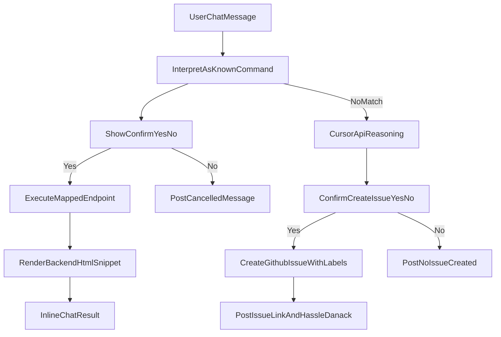

# Bot Chat Confirm-First Pipeline Plan

## Goals
- Add a `bot chat` command layer that maps natural chat requests to known tasks/endpoints using a PHP `match` statement.
- Require user confirmation before executing even known mapped commands, explicitly confirming that the bot's interpreted known command is what the user meant.
- Show confirmation controls inline in chat with a red `No` button on the left and a green `Yes` button on the right.
- For unmapped requests, infer likely intent/endpoint via Cursor API, then ask user to confirm creating a GitHub issue for command review.
- Add a `command-review` skill/workflow to list and triage queued command-review issues.

## Phase 1: Define Bot Command Contract
- Add a backend command catalog (initially PHP `match`) with:
  - `exampleUserPhrases`
  - `taskName`
  - `targetEndpoint`
  - `parameterBuilder`
  - `resultRenderMode` (chat text vs HTML snippet)
- Start with at least one concrete command: "show me all files that don't have tags".
- Since room-file untagged filtering is not currently available, include one of:
  - temporary fallback behavior (closest supported file search), or
  - add `untagged` filtering support in room-file search (preferred for correctness).

Primary files:
- [`/Users/danack/projects/github/Bristolian/src/Bristolian/AppController/Chat.php`](/Users/danack/projects/github/Bristolian/src/Bristolian/AppController/Chat.php)
- [`/Users/danack/projects/github/Bristolian/src/Bristolian/Parameters/ChatMessageParam.php`](/Users/danack/projects/github/Bristolian/src/Bristolian/Parameters/ChatMessageParam.php)
- [`/Users/danack/projects/github/Bristolian/src/Bristolian/Repo/RoomFileRepo/PdoRoomFileRepo.php`](/Users/danack/projects/github/Bristolian/src/Bristolian/Repo/RoomFileRepo/PdoRoomFileRepo.php) (if adding real untagged support)

## Phase 2: Confirm-First Interaction in Chat UI
- Add a "bot interpretation" message type that includes:
  - interpreted command/task text
  - endpoint preview
  - pending action token/id
  - inline action buttons
- The interpretation prompt text must ask for explicit confirmation that this interpreted known command is what the user wants.
- Render buttons in chat message row:
  - left: red `No`
  - right: green `Yes`
- Clicking `Yes` executes the mapped command.
- Clicking `No` cancels execution and posts a short bot acknowledgement.

Primary files:
- [`/Users/danack/projects/github/Bristolian/app/public/tsx/ChatPanel.tsx`](/Users/danack/projects/github/Bristolian/app/public/tsx/ChatPanel.tsx)
- [`/Users/danack/projects/github/Bristolian/app/public/tsx/chat/ChatBottomPanel.tsx`](/Users/danack/projects/github/Bristolian/app/public/tsx/chat/ChatBottomPanel.tsx)
- [`/Users/danack/projects/github/Bristolian/app/public/scss/chat.scss`](/Users/danack/projects/github/Bristolian/app/public/scss/chat.scss)
- [`/Users/danack/projects/github/Bristolian/src/Bristolian/ChatMessage/ChatType.php`](/Users/danack/projects/github/Bristolian/src/Bristolian/ChatMessage/ChatType.php)

## Phase 3: Command Execution + Inline Results
- On approval, backend performs mapped API operation and returns chat-renderable result payload.
- Render result inline in chat panel.
- Implement backend-rendered HTML snippets for structured result cards (as requested), passed to frontend as trusted snippet payload for bot message rows only.
- Ensure normal user chat text remains escaped/plain.

Primary files:
- [`/Users/danack/projects/github/Bristolian/src/Bristolian/AppController/Chat.php`](/Users/danack/projects/github/Bristolian/src/Bristolian/AppController/Chat.php)
- [`/Users/danack/projects/github/Bristolian/src/functions_chat.php`](/Users/danack/projects/github/Bristolian/src/functions_chat.php)
- [`/Users/danack/projects/github/Bristolian/app/public/tsx/ChatPanel.tsx`](/Users/danack/projects/github/Bristolian/app/public/tsx/ChatPanel.tsx)
- [`/Users/danack/projects/github/Bristolian/src/Bristolian/Response/`](/Users/danack/projects/github/Bristolian/src/Bristolian/Response/) (new bot-response classes)

## Phase 4: Unmapped Command Reasoning + Issue Creation (Confirm Required)
- For unmapped input, call Cursor API reasoning step to suggest:
  - likely task name
  - likely endpoint mapping
  - short rationale
- Post candidate interpretation in chat and ask whether to create review issue.
- On user confirmation (`Yes`), create GitHub issue with labels:
  - `queue-command-review`
  - `source-chat`
  - `reason-unmapped-command`
- Post confirmation message in chat including issue URL and "hassle Danack" text.

Primary files:
- [`/Users/danack/projects/github/Bristolian/src/Bristolian/AppController/Chat.php`](/Users/danack/projects/github/Bristolian/src/Bristolian/AppController/Chat.php)
- [`/Users/danack/projects/github/Bristolian/src/Bristolian/Config/Config.php`](/Users/danack/projects/github/Bristolian/src/Bristolian/Config/Config.php)
- [`/Users/danack/projects/github/Bristolian/config.source.php`](/Users/danack/projects/github/Bristolian/config.source.php)
- [`/Users/danack/projects/github/Bristolian/src/Bristolian/Service/HttpFetcher/HttpFetcher.php`](/Users/danack/projects/github/Bristolian/src/Bristolian/Service/HttpFetcher/HttpFetcher.php) (reuse for GitHub API calls)

## Phase 5: Add Command-Review Skill / Workflow
- Create a `command-review` skill/workflow that:
  - fetches open issues with `queue-command-review`
  - groups/sorts by recency and confidence
  - outputs shortlist for your choose-implement-or-close workflow
- Include explicit triage actions:
  - implement candidate
  - close as not planned
  - request clarification

Primary files:
- [`/Users/danack/projects/github/Bristolian/.cursor/skills/command-review/SKILL.md`](/Users/danack/projects/github/Bristolian/.cursor/skills/command-review/SKILL.md) (new)
- optionally helper command docs under [`/Users/danack/projects/github/Bristolian/.cursor/commands/`](/Users/danack/projects/github/Bristolian/.cursor/commands/)

## Data/Flow Outline

## Testing and Rollout
- Backend unit/integration tests for:
  - command matching
  - confirm token lifecycle
  - `Yes/No` action handling
  - unmapped issue creation confirmation path
- Frontend tests for:
  - inline confirmation UI and button ordering/colors
  - rendering of approved command result snippets
- Add a feature flag for bot-command execution so rollout can be gradual.

## Acceptance Criteria
- Known commands never execute without explicit in-chat confirmation.
- Confirm UI shows red `No` on the left and green `Yes` on the right.
- Approved known command result appears inline in chat.
- Unmapped command proposes inferred mapping and requires explicit confirmation before GitHub issue creation.
- Chat posts issue-created acknowledgment including "hassle Danack" phrase.
- `command-review` skill lists queued command-review issues for manual triage.